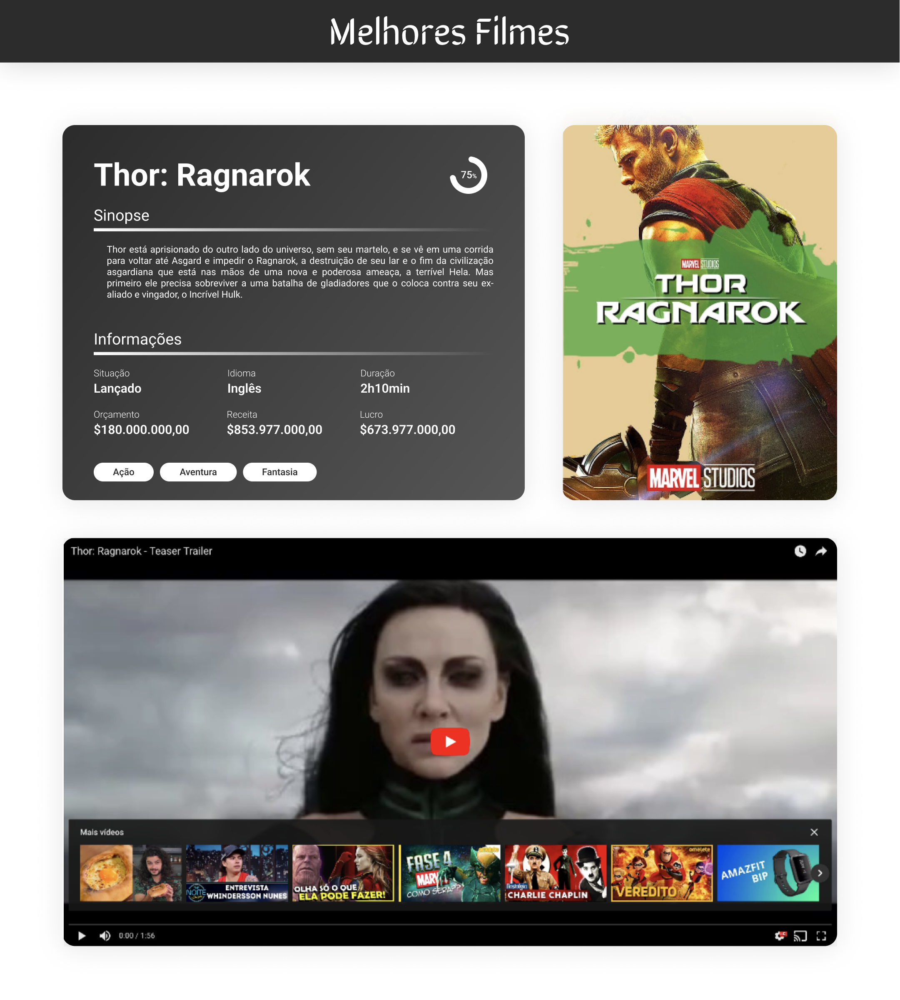

<h1 align="center">
    
     
     
    Desafio Técnico Front-end Cubos Academy
     
     
</h1>

### Objetivo

Implementar uma aplicação web responsiva que consuma a [API do The Movie DB](https://www.themoviedb.org/documentation/api), podendo um catálogo de filmes e seus detalhes.

### Especificações

O app deverá ter as seguintes funcionalidades:
- Permitir buscar filmes por nome ou gênero
- Resultados de busca paginados, 5 por página
- Ser fiel ao design proposto (mostrando todas as informações e seguindo corretamente os espaçamentos de _margins_ e _paddings_)
- Ser responsivo
- Ter boa performance
- Funcionar na última versão dos principais browsers (Chrome, Firefox, Safari e Edge)

O app não poderá:
- Fazer uso de frameworks CSS, como Bootstrap e Foundation

### Especificações adicionais

As especificações a seguir **não são obrigatórias**, mas contam pontos **extras**:
- Utilizar HTML semântico
- Demonstrar domínio de features modernas (ES6+) do Javascript
- Ser um PWA
- Fizer uso de uma ou mais das seguintes ferramentas:
    - React, Vue, Angular ou similares
    - Typescript, Flow ou similares
    - Redux, MobX ou similares

### O aplicação web deverá reproduzir os seguintes designs:

> Listagem de filmes e filtros:
> 

---

> Detalhes do filme:
> 

A fonte usada nas telas é a **Roboto**.

## Entrega

O projeto do desafio técnico deve ser entregue em um dos seguintes formatos:
- Repositório hospedado (Github, Gitlab, Bitbucket ou similares)
- Arquivo compactado

Em ambos os casos, deve existir um arquivo README.md no projeto com instruções para a compilação/execução da aplicação web.
